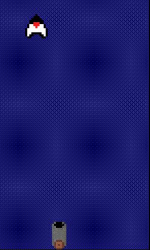
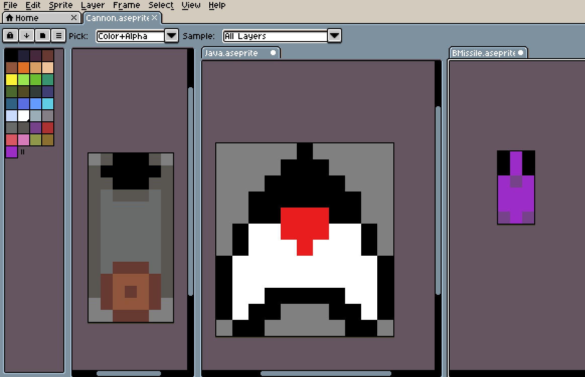

# Space Invaders

My Take on Space Invaders, using a Functional Programming language called Racket. 
There are no classes, arrays, or even loops! Everything from the rendering to collision detection was done soley using primitive structs, linked lists, and recursion.

## Unit Testing
A Major advantage of this style of programming is that it is extremely easy to test. 

To thoroughly create tests with Object Oriented Programming, you need to go through a tedious process of bringing the object to the required state, before checking if the behavior is as expected.

## Art
I like to create my own assets for the things I create, so I used [Asperite](https://www.aseprite.org/) to create the pixel art used.

